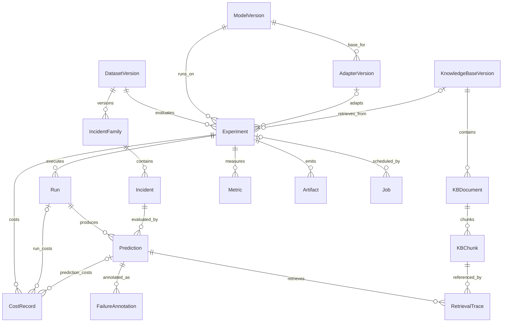

# EvalForge Architecture — Phase 01 Contract

## Purpose

This document freezes architectural boundaries and decision ownership before implementation. Later phases may refine internals, but material changes require an ADR.

## Target system

```text
React + TypeScript UI
        | REST + SSE
        v
FastAPI application ---------------------- OpenTelemetry
        |                                      |
        | enqueue                              v
        v                                  service traces
Redis broker/progress <----> Worker(s) ---- Langfuse LLM traces
                                |
                                +--> Base inference
                                +--> RAG inference
                                +--> Fine-tuned inference
                                +--> Combined inference
                                +--> Evaluation harness
                                +--> Training orchestration
                                |
                                v
                         PostgreSQL + pgvector
                         - datasets / incident families
                         - model and adapter versions
                         - KB versions / documents / chunks
                         - experiments / runs / predictions
                         - retrieval traces / metrics / failures
                         - jobs / artifacts / cost ledger

External evidence systems:
- Weights & Biases: training/evaluation run evidence and artifacts
- Hugging Face Hub: released adapter/model card
- Deployment platform: public application/API and read-only experiment evidence
```

## Architectural invariants

- Python 3.11+ for backend/evaluation/retrieval/training code.
- React + TypeScript for the frontend.
- PostgreSQL + pgvector is the durable system of record.
- Redis plus a real worker process owns long-running evaluation/training jobs; HTTP request handlers never execute large loops synchronously.
- Database schema changes are migration-backed by Alembic and must migrate from an empty database.
- All four primary pipelines use the same frozen base-model ID/revision.
- Exact structured root-cause labels are primary ground truth.
- Every published metric is derived from stored experiment evidence; no hard-coded result values.
- RAGAS/LLM judges remain supporting evaluators only when deterministic ground truth exists.
- W&B, Langfuse, and OpenTelemetry have separate responsibilities and are not interchangeable.

## Component responsibility boundaries

### FastAPI
Owns REST/SSE contracts, validation, authentication/rate-limit boundaries when introduced, read/write orchestration, and job submission. It must not own long-running model loops.

### Worker
Owns training/evaluation/retrieval-heavy execution, progress events, retries, and durable result writes.

### PostgreSQL + pgvector
Owns canonical relational experiment state and vector retrieval data. Later phases define normalized entities and migration history.

### Redis
Owns queue/broker/progress/cache responsibilities only; it is not the durable source of research truth.

### Evaluation library
Owns common prediction/evaluation contracts and metrics. All four pipelines plug into the same evaluator.

### Observability
- W&B: ML training/evaluation run evidence and artifacts.
- Langfuse: LLM/prompt/retrieval/token/cost traces.
- OpenTelemetry: service/API/worker infrastructure traces.

## ADR index

- [ADR-001](adrs/ADR-001-fastapi-boundary.md) — FastAPI service boundary
- [ADR-002](adrs/ADR-002-react-typescript.md) — React + TypeScript frontend
- [ADR-003](adrs/ADR-003-postgres-pgvector-alembic.md) — PostgreSQL, pgvector, Alembic
- [ADR-004](adrs/ADR-004-redis-worker.md) — Redis and worker architecture
- [ADR-005](adrs/ADR-005-primary-model.md) — Primary base model
- [ADR-006](adrs/ADR-006-rag-evaluation-integrity.md) — RAG/evaluation integrity
- [ADR-007](adrs/ADR-007-mlops-evidence.md) — W&B and Hugging Face evidence
- [ADR-008](adrs/ADR-008-observability.md) — Langfuse and OpenTelemetry
- [ADR-009](adrs/ADR-009-containers-cicd-deployment.md) — Docker Compose, CI/CD, deployment

## Phase 04 persistence and reproducibility schema

Alembic revision `0002_phase04` is the first domain-schema revision. PostgreSQL is authoritative for research identity and the `vector` extension is enabled for versioned knowledge-base chunks. The schema is deliberately normalized around immutable version identities and experiment evidence rather than dashboard-shaped denormalized rows.



Canonical Phase 04 tables:

| Entity | Identity / invariant |
| --- | --- |
| `dataset_versions` | Immutable dataset version, manifest/content checksums, schema/taxonomy version, split seed and counts. |
| `incident_families` | Composite `(dataset_version, family_id)` identity; one frozen split per family. |
| `incidents` | Composite dataset-qualified incident identity; FK includes family split so an incident cannot disagree with its family split. |
| `model_versions` | Immutable exact model ID + revision. |
| `adapter_versions` | Immutable adapter revision bound to exactly one base-model version. |
| `knowledge_base_versions` | Immutable embedding/chunking/reranking identity. |
| `kb_documents` / `kb_chunks` | Version-qualified source documents and pgvector-backed chunks. |
| `experiments` | Canonical experiment config JSON + SHA-256, all reproducibility fields, and version FKs. Completed rows are frozen. |
| `runs` | Retry/attempt execution records under one experiment. |
| `predictions` | Run + experiment + dataset-qualified incident evidence; cross-version references are rejected by composite FKs. |
| `retrieval_traces` | Ranked KB-chunk provenance tied to the prediction's KB version. |
| `metrics` | Persisted deterministic/supporting metric values. |
| `failure_annotations` | Versioned failure taxonomy annotations on stored predictions. |
| `artifacts` | URI + SHA-256 evidence emitted by an experiment. |
| `jobs` | Durable idempotency key, payload hash, retry/status state. |
| `cost_records` | Versioned rate snapshot and normalized USD cost evidence. |

Historical `dataset_versions`, `model_versions`, `adapter_versions`, and `knowledge_base_versions` reject UPDATE/DELETE at the database layer. Completed experiments reject mutation. New historical meaning therefore requires a new version/experiment rather than overwriting evidence.

## Phase boundary

Phase 01 freezes the original architectural decisions. Phase 04 materializes the PostgreSQL/pgvector persistence contract defined by those decisions. Later phases may add new migration-backed fields or tables, but they must preserve existing historical identities and reproducibility semantics.
